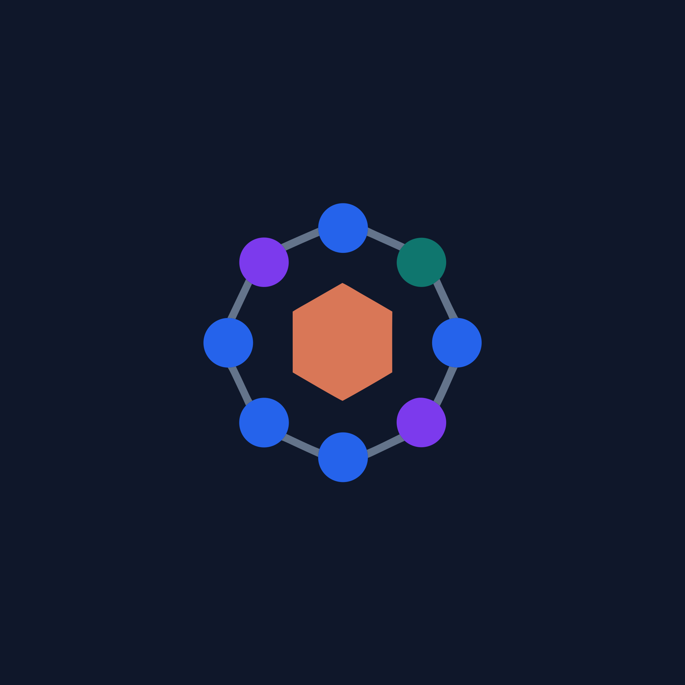
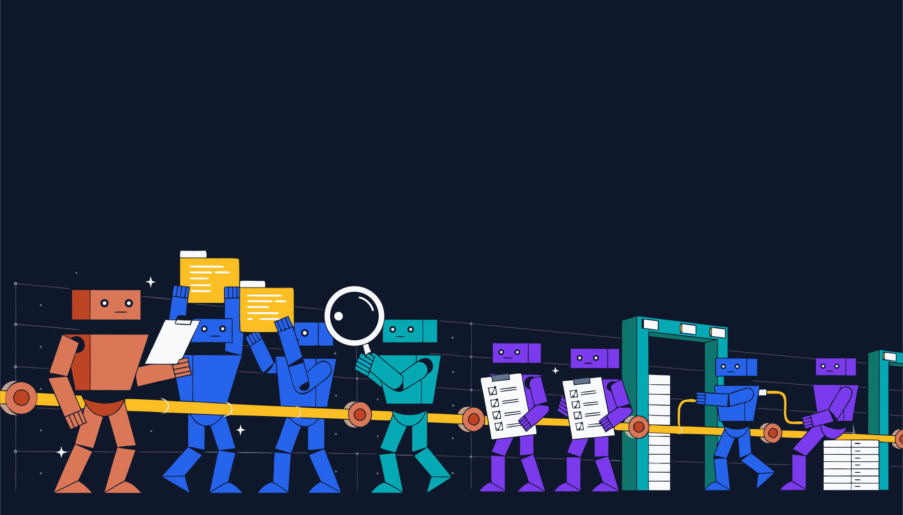
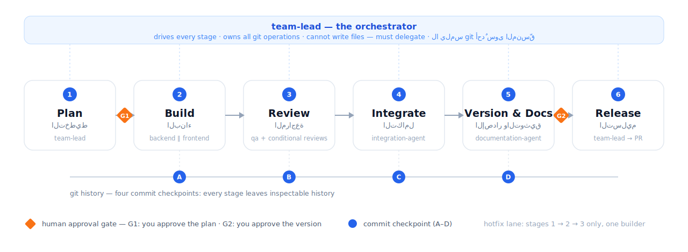
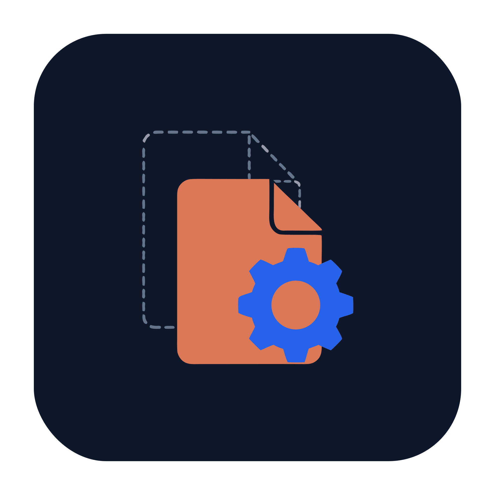
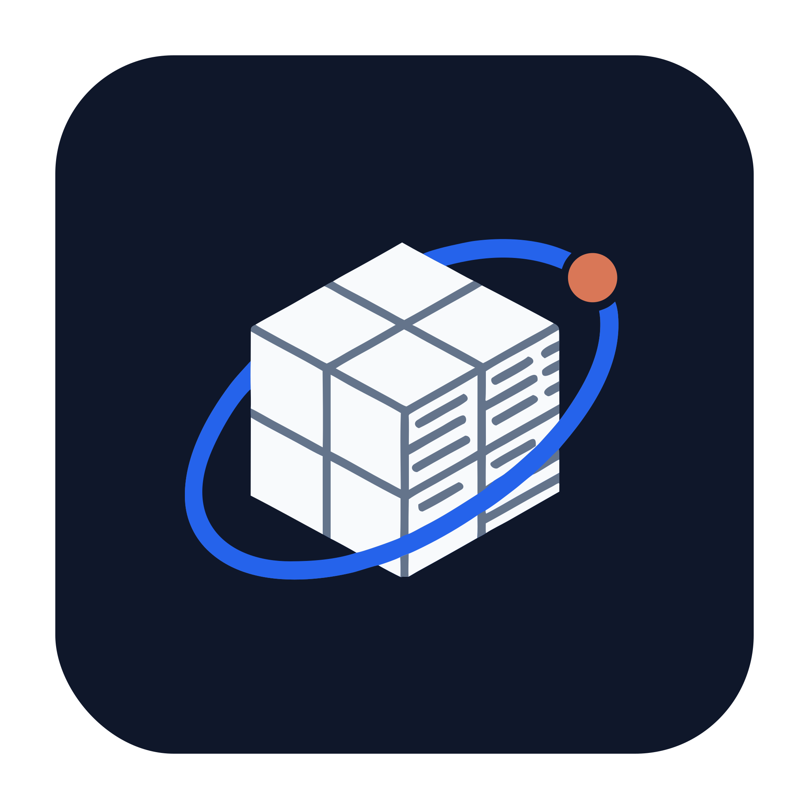

<!-- Translated from README.md @ v0.2.0 (2026-07-15). English is canonical — لا تُحرّر هذا الملف دون مزامنة الأصل الإنجليزي -->

<div align="center">



# فريق وكلاء Claude Code

**منهجية تطوير متعددة الوكلاء مجرّبة في الإنتاج — داخل Claude Code**

[](docs/ar/case-study.ar.md)
[](agents/)
[](playbook/01-pipeline.md)
[](https://docs.anthropic.com/en/docs/claude-code)
[](README.md)
[](CONTRIBUTING.md)
[](LICENSE)

[**دليل البدء**](docs/ar/getting-started.ar.md) ·
[**نظرة عامة على المنهجية**](docs/ar/playbook-overview.ar.md) ·
[**دراسة الحالة**](docs/ar/case-study.ar.md) ·
[**🇬🇧 Read in English**](README.md)



</div>

<div dir="rtl">

> حوِّل Claude Code إلى فريق تطوير برمجيات متكامل: 9 وكلاء متخصصين (Sub-agents)، خط تسليم من 6 مراحل، ذاكرة للوكلاء، وبروتوكولات مراجعة — مستخلصة من نظام إنتاجي حقيقي شحن أكثر من 200 إصدار بهذه الطريقة.

دليل منهجي (playbook) مجرّب في الإنتاج لتطوير البرمجيات متعدد الوكلاء داخل Claude Code: تسعة وكلاء متخصصين (Sub-agents) يعملون معًا كفريق تطوير واحد منسّق. منسّقٌ من نوع team-lead يقود وكلاء الـ backend والـ frontend والـ QA والتكامل والمراجعة الأمنية ومراجعة الـ migrations وتصميم واجهات الاستخدام والتوثيق عبر خط أنابيب من 6 مراحل، بنقاط commit تفتيشية وبروتوكولات أحكام (verdicts) صارمة. يراكم الوكلاء معرفتهم في نظام ذاكرة مستقل لكل وكيل، وتغذّي الأخطاء المتكررة مكتبةَ أنماط، وتحافظ prompts الروتينات الدورية (مراجعة الكود اليومية، مسح الأنماط المتكررة، المسح الأمني) على الجودة من الانحراف مع الزمن. يتضمن المستودع قالب «دستور» CLAUDE.md، وmeta-prompt يولّد دستورًا خاصًا بمشروعك، ومثالًا تطبيقيًا كاملًا بـ Laravel + React. وكل شيء موثّق بالإنجليزية والعربية معًا.

> **لستَ بحاجة لأن تكون متخصصًا لتبني برمجيات حقيقية — بل أن تقود فريقًا يجيدها.**
> هذا الدليل هو ذلك الفريق، والانضباط الذي يُبقيه صادقًا.

**أكثر من 200 إصدار إنتاجي · شخص واحد · 9 وكلاء · منصة حيّة «عربية أولًا» (Arabic-first)**

<details>
<summary><b>المحتويات</b></summary>

- [لمن هذا المستودع (ولمن ليس له)](#لمن-هذا-المستودع-ولمن-ليس-له)
- [الأفكار الثلاث الحاملة](#الأفكار-الثلاث-الحاملة)
- [البدء السريع](#البدء-السريع--ثلاث-خطوات-انسخ-والصق)
- [كيف يعمل خط الأنابيب](#كيف-يعمل-خط-الأنابيب-ذو-المراحل-الست)
- [ماذا ستحصل عليه](#ماذا-ستحصل-عليه)
- [أدوار الوكلاء التسعة](#أدوار-الوكلاء-التسعة-sub-agents)
- [بمَ يختلف هذا؟](#بمَ-يختلف-هذا-عن-مستودعات-الوكلاء-الأخرى)
- [القصة](#القصة)
- [خريطة المستودع](#خريطة-المستودع)
- [الأسئلة الشائعة والمساهمة والترخيص](#الأسئلة-الشائعة-والمساهمة-والترخيص)

</details>

## لمن هذا المستودع (ولمن ليس له)

> [!TIP]
> **هذا لك إذا كنت:** تشغّل Claude Code على قاعدة كود حقيقية طويلة العمر — وحدك أو ضمن فريق صغير — وتريد أن تصلك التغييرات التي يبنيها الذكاء الاصطناعي مخطَّطةً ومُراجَعةً ومتكاملةً وموثّقةً ومثبَّتةً بـ commits منضبطة، بدل أن تُرَشّ عشوائيًا في شجرة العمل لديك.

<!-- -->

> [!CAUTION]
> **ليس لك إذا كنت:** تريد سربَ وكلاء مستقلًا بالكامل (انظر CrewAI / AutoGen — رفٌّ مختلف)، أو تستخدم سلسلة أدوات غير Claude Code (*المنهجية* تنتقل، لكن صيغة ملفات الوكلاء لن تنتقل)، أو كان مشروعك تجربةَ عطلة نهاية أسبوع تُرمى لاحقًا، حيث يكلّفك خط أنابيب من 6 مراحل أكثر مما يحميك. راجع [متى *لا* تستخدم خط الأنابيب الكامل](docs/faq.md#when-should-i-not-use-the-full-pipeline) (EN).

## الأفكار الثلاث الحاملة

كل ما عداها تفصيل. إن لم تتذكر شيئًا من هذا المستودع فتذكر هذه الثلاث — والمنطق الكامل في [playbook/00-overview.md](playbook/00-overview.md) (EN).

1. **مالك واحد لـ git.** المنسّق وحده يشغّل `git`/`gh`؛ تحدث الـ commits عند أربع نقاط تفتيشية مُسمّاة. تصبح تعارضات الدمج بين الوكلاء مستحيلة بنيويًا، ويبقى التاريخ واضحًا.
2. **الأحكام عقود، لا نثر.** كل مُراجِع ينتهي بسلسلة نصية دقيقة (`QA APPROVED ✅`) يتفرّع عليها المنسّق — فـ«يبدو جيدًا في مجمله»، ذلك الإخفاق الناعم المعتاد للذكاء الاصطناعي حين يراجع نفسه، ليس ناتجًا ممكنًا.
3. **القضاة لا يُمسكون أقلامًا.** المُراجِعون بلا أدوات كتابة؛ والوكيل الوحيد الذي *يستطيع* الكتابة أثناء التحقق لا يُصدر أحكامًا. فصل الحكم عن الإصلاح هو ما يجعل للموافقة معنى.

## البدء السريع — ثلاث خطوات انسخ-والصق

الشرح الكامل خطوة بخطوة: [**دليل البدء بالعربية**](docs/ar/getting-started.ar.md)

**1 — انسخ قوالب الوكلاء إلى مشروعك:**

```bash
npx degit alikwan/claude-code-agent-team/agents .claude/agents --force
rm .claude/agents/README.md      # docs, not an agent definition
rm -r .claude/agents/optional    # keep only if you want the optional test-engineer
npx degit alikwan/claude-code-agent-team/templates .claude/pipeline-templates --force
```

**2 — ولّد دستور مشروعك.** افتح Claude Code في جذر مستودعك والصق الـ meta-prompt من [`templates/generate-your-claude-md.md`](templates/generate-your-claude-md.md) (EN) — سيستكشف مستودعك، ويطرح عليك 6 أسئلة كحد أقصى، ثم يكتب ملف `CLAUDE.md` كاملًا.

**3 — املأ الـ placeholders وشغّل مهمتك الأولى:**

```bash
# replace the {{PLACEHOLDER}} tokens per docs/placeholders.md, then verify —
# must return nothing (${{ ... }} in CI templates is GitHub Actions syntax, not a placeholder):
grep -rnE '\{\{[A-Z][A-Z0-9_]*\}\}' .claude/ CLAUDE.md

claude --agent team-lead   # the orchestrator IS your main session
                           # (or pick team-lead from the agent selector)
```

أعطه مهمة حقيقية. سيقرأ دستورك، ويعرض عليك خطة، وينتظر موافقتك، ثم يقود الفريق.

## كيف يعمل خط الأنابيب ذو المراحل الست



بوابتان بشريتان (توافق أنت على **الخطة**، ثم على **الإصدار**)، وأربع نقاط commit تفتيشية (كل مرحلة تترك خلفها تاريخًا قابلًا للفحص)، وأحكامٌ على هيئة سلاسل نصية دقيقة تُفسَّر آليًا (`QA APPROVED ✅` — وليس أبدًا «يبدو جيدًا في مجمله»).

> [!IMPORTANT]
> قاعدة حديدية واحدة: **لا يلمس git أحدٌ سوى المنسّق.** الآليات الكاملة: [playbook/01-pipeline.md](playbook/01-pipeline.md) (EN) — وتتوفر [نظرة عامة على فصول الـ playbook بالعربية](docs/ar/playbook-overview.ar.md).

## ماذا ستحصل عليه

<table dir="rtl">
<tr><th>الأصل</th><th>المكان</th><th>ما هو</th></tr>
<tr>
  <td> <b>الدليل&nbsp;المنهجي&nbsp;(playbook)</b></td>
  <td><a href="playbook/"><code>playbook/</code></a> (EN) — <a href="docs/ar/playbook-overview.ar.md">نظرة عامة بالعربية</a></td>
  <td>9 فصول: خط الأنابيب، الأدوار، البروتوكولات، أنماط الأخطاء، فحوص «الميزات الشبح»، الذاكرة، الروتينات الدورية، الملاحظات الميدانية</td>
</tr>
<tr>
  <td> <b>قوالب&nbsp;9&nbsp;وكلاء&nbsp;(+1&nbsp;اختياري)</b></td>
  <td><a href="agents/"><code>agents/</code></a> (EN)</td>
  <td>ملفات Sub-agents جاهزة لـ Claude Code، مُعامَلة بالكامل (parameterized) — انسخ، استبدل القيم، شغّل</td>
</tr>
<tr>
  <td> <b>روتينات&nbsp;مراجعة&nbsp;دورية</b></td>
  <td><a href="prompts/"><code>prompts/</code></a> (EN)</td>
  <td>مراجعة كود يومية، مسح للأنماط المتكررة، مسح أمني رباعي الأسطح — جدوِلها وانسَها</td>
</tr>
<tr>
  <td> <b>قوالب</b></td>
  <td><a href="templates/"><code>templates/</code></a> (EN)</td>
  <td>دستور CLAUDE.md + الـ meta-prompt المولِّد له، ذاكرة الوكلاء، عقد الـ API، أجسام الـ PR، الأذونات، CI</td>
</tr>
<tr>
  <td> <b>مثال&nbsp;تطبيقي&nbsp;كامل</b></td>
  <td><a href="examples/laravel-react/"><code>examples/laravel-react/</code></a> (EN)</td>
  <td>كل ملف عام مُجسَّدًا لمستودع monorepo يجمع Laravel 12 API + React SPA — بما في ذلك prompts المراجعة الإنتاجية العربية الأصلية</td>
</tr>
</table>

## أدوار الوكلاء التسعة (Sub-agents)

<table dir="rtl">
<tr><th>الوكيل</th><th>مهمته</th><th>القيد الأساسي</th></tr>
<tr><td><code>team-lead</code></td><td>يخطّط، ينسّق، يملك <b>كل</b> عمليات git، ويفتح الـ PR</td><td>لا يستطيع كتابة الملفات — عليه التفويض</td></tr>
<tr><td><code>backend-dev</code> / <code>frontend-dev</code></td><td>يبنيان بالتوازي وفق عقد API مشترك</td><td>لا يشغّلان git أبدًا</td></tr>
<tr><td><code>qa-engineer</code></td><td>يراجع الـ diff، يشغّل الاختبارات والـ lint، ويجرّب المسار فعليًا</td><td>قراءة فقط — القاضي لا يُمسك قلم التصحيح</td></tr>
<tr><td><code>security-reviewer</code></td><td>قائمة فحص أمنية من 10 فئات (شرطي)</td><td>قراءة فقط، نموذج اقتصادي</td></tr>
<tr><td><code>migration-reviewer</code></td><td>سلامة migrations قاعدة البيانات (شرطي)</td><td>قراءة فقط، نموذج اقتصادي</td></tr>
<tr><td><code>integration-agent</code></td><td>يكتشف «الميزات الشبح» — المبنية لكن غير الموصولة — ويصلحها</td><td>يوصّل ولا يُصدر أحكامًا أبدًا</td></tr>
<tr><td><code>documentation-agent</code></td><td>تدقيق توثيق مُعطِّل (blocking) — والـ CHANGELOG دائمًا</td><td>لا PR قبل COMPLETE</td></tr>
<tr><td><code>ui-ux-designer</code></td><td>مواصفات تصميم قبل الكود (اختياري)</td><td>واعٍ بواجهات RTL والعربية أولًا</td></tr>
</table>

لماذا يوجد كل وكيل — وبأي ثلاثة منهم يمكنك البدء: [playbook/02-roles.md](playbook/02-roles.md) (EN).

> [!NOTE]
> **لا تحتاج التسعة جميعًا؟** ابدأ بـ**ثلاثة** — المنسّق + بنّاء واحد + `qa-engineer`. يحفظ ذلك الخاصيتين الأهم (التخطيط قبل الكود، والمراجعة المستقلة). أضف `integration-agent` مع اتساع سطح التوصيل، والمراجِعين الشرطيين حين تمتلك قاعدة بيانات وسطح هجوم، و`documentation-agent` حين يصير لديك مستخدمون. مسار النمو الكامل: [playbook/02-roles.md](playbook/02-roles.md#scaling-the-team-down-and-up) (EN).

## بمَ يختلف هذا عن مستودعات الوكلاء الأخرى؟

- **ليس مجموعة prompts.** كل ملف متشابك مع غيره: الوكلاء يستشهدون بخط الأنابيب، وخط الأنابيب يستشهد ببروتوكول الأحكام، والـ CI يفرض المفردات نفسها. إنها منهجية متكاملة، لا مقتطفات متناثرة.
- **ليس إطار عمل مستقلًا ذاتيًا.** هذا نظام يُبقي الإنسان في الحلقة عن عمد — بوابتا موافقة، وانضباط git، وإيصالات في كل مرحلة. الهدف تغييرات جديرة بالثقة على قاعدة كود تهمّك، لا أقصى قدر من الاستقلالية.
- **مُكتسَب بالتجربة، لا مُخترَع.** كل قاعدة هنا تعود إلى شيء انكسر فعلًا في الإنتاج. جاءت [مكتبة أنماط الأخطاء](playbook/04-bug-patterns.md) (EN) من نحو 30 عائق مراجعة (blockers) حقيقيًا؛ وتوثّق [الملاحظات الميدانية](playbook/08-field-notes.md) (EN) إخفاقاتنا، بما فيها تلك التي يصلحها الإصدار v1.1 من هذا الخط.

## القصة

مطوّر واحد، ومنصة تحصيل كبيرة «عربية أولًا»، واكتشافٌ مفاده أن جلسة ذكاء اصطناعي واحدة تكتب الكود دون إشراف تُنتج بالضبط الأخطاء التي تتوقعها من مطوّر بلا ذاكرة، وبلا مُراجع، وبلا خوف. تكثّف خط الأنابيب هذا من إصلاح ذلك — إصدارًا بعد إصدار، على مدى أكثر من 200 إصدار. اقرأ الرواية الصادقة، بما فيها ما لا يزال لا يعمل حتى الآن: [دراسة الحالة](docs/ar/case-study.ar.md).

This methodology is fully documented in English too — [start here](README.md).

## خريطة المستودع

```
playbook/     the methodology, 9 chapters — the "why and how"
agents/       10 sub-agent templates ({{parameterized}})
prompts/      standing routines — pasted into sessions on a schedule
templates/    files that live in YOUR repo after adaptation
docs/         using this repo: getting started, placeholders, case study, FAQ (+ Arabic twins in docs/ar/)
examples/     laravel-react/ — every generic file made concrete
```

## الأسئلة الشائعة والمساهمة والترخيص

- الأسئلة الشائعة — التكلفة، الفِرَق المصغّرة، الحزم التقنية غير Laravel: [docs/faq.md](docs/faq.md) (EN)
- المساهمات مرحّب بها — خصوصًا مواءمات `examples/<your-stack>/` وأنماط أخطاء مدعومة بالأدلة: [CONTRIBUTING.md](CONTRIBUTING.md) (EN)
- تقارير الأمان وتسريب البيانات: [SECURITY.md](SECURITY.md) (EN)

</div>

---

<div align="center">

[MIT](LICENSE) © 2026 [Ali Kwan](https://alikwan.com)

[⬆ العودة إلى الأعلى](#فريق-وكلاء-claude-code)

</div>
