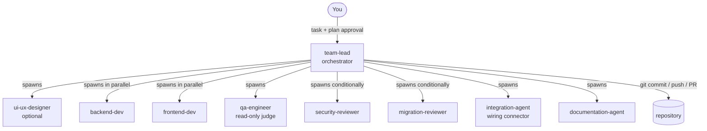

# 00 — Overview: The Operating Model

This playbook turns a single Claude Code session into a coordinated software
team: one orchestrator that plans and owns version control, specialist builders
that implement in parallel, and independent verifiers that judge the work
before it ships. It was not designed on a whiteboard — it condensed out of
running a real production system, release after release, and keeping what
survived contact with reality. Over 200 production releases have shipped
through it.

## The shape of the team

One session — the **orchestrator** — runs the show. It reads the project
constitution (`CLAUDE.md`), produces a plan, waits for your approval, then
drives the work through six stages by spawning specialist sub-agents. It is
the **only** participant that touches git. Everyone else reads and writes
files, reports a verdict, and exits.

## The three load-bearing ideas

Everything else in this playbook is detail. These three are the foundation:

### 1. A single git owner

Only the orchestrator runs `git` and `gh`. Builders build, reviewers review —
none of them commit. All commits happen at four named checkpoints (A–D, see
[chapter 01](01-pipeline.md)) with conventional messages. The result: a
linear, legible history where every commit corresponds to a pipeline stage,
merge conflicts between agents are structurally impossible, and a crashed
session never leaves half-staged mystery state.

### 2. Verdicts are contracts, not prose

Every verifier ends its report with an exact, canonical string —
`QA APPROVED ✅`, `INTEGRATION BLOCKED ⚠️`, `SECURITY REVIEW: APPROVED ✅`.
The orchestrator branches on these strings. Because the formats are fixed
(defined once in [chapter 03](03-communication-protocol.md) and repeated
verbatim in every agent template), a verdict can never be misread as
commentary, and "it looks mostly fine" — the classic soft failure of
AI-reviewing-AI — is not a possible output.

### 3. Judges don't hold pens

The agents that evaluate work cannot modify it. `qa-engineer`,
`security-reviewer`, and `migration-reviewer` have no Write/Edit tools — a
reviewer that can quietly fix what it finds will quietly approve what it
fixed. Conversely, the agent that *can* write during verification
(`integration-agent`) explicitly does not judge: it connects, and anything
non-trivial it changes goes back to a scoped QA re-check. Separation of
judgment from repair is what makes the approvals mean something.

## What this is — and is not

**It is** a human-in-the-loop delivery discipline. You approve the plan before
any code is written and the version before anything is released. Between those
two gates, the team runs autonomously — but every stage leaves a committed,
inspectable trail.

**It is not** an autonomous agent swarm. If you want fire-and-forget code
generation, frameworks like CrewAI or AutoGen are shaped for that. This
playbook optimizes for something different: shipping changes to a real,
long-lived codebase without accumulating the silent damage that unreviewed
AI output causes — contract mismatches, phantom features, undocumented drift.

**It is not** tied to one stack. The pipeline, roles, and protocols are
framework-agnostic; every stack-specific value is a registered
[placeholder](../docs/placeholders.md). A complete worked adaptation for
Laravel + React lives in [`examples/laravel-react/`](../examples/laravel-react),
and the methodology originally shipped its 200+ releases on a different
frontend framework entirely — the agents carried over unchanged.

## How the pieces relate

| You want to... | Go to |
| :--- | :--- |
| Understand the flow end-to-end | [01 — The Pipeline](01-pipeline.md) |
| Know what each agent does and why | [02 — Roles](02-roles.md) |
| See the exact rules agents follow with each other | [03 — Communication Protocol](03-communication-protocol.md) |
| Steal the review checklists | [04 — Bug Patterns](04-bug-patterns.md), [05 — Phantom Checks](05-phantom-checks.md) |
| Make agents smarter over time | [06 — The Memory System](06-memory-system.md) |
| Catch drift the pipeline can't | [07 — Standing Routines](07-standing-routines.md) |
| Avoid our production mistakes | [08 — Field Notes](08-field-notes.md) |
| Set it up on your project | [Getting started](../docs/getting-started.md) |

> **A note on version:** this published pipeline is **v1.1**. It is the
> production pipeline plus a small set of protocol fixes we found while
> preparing it for release (an unreviewed-integration-changes hole, a
> version-approval ordering bug, and an escalation-rule wording gap). Each fix
> is marked where it appears, and [chapter 08](08-field-notes.md) tells the
> stories honestly.
