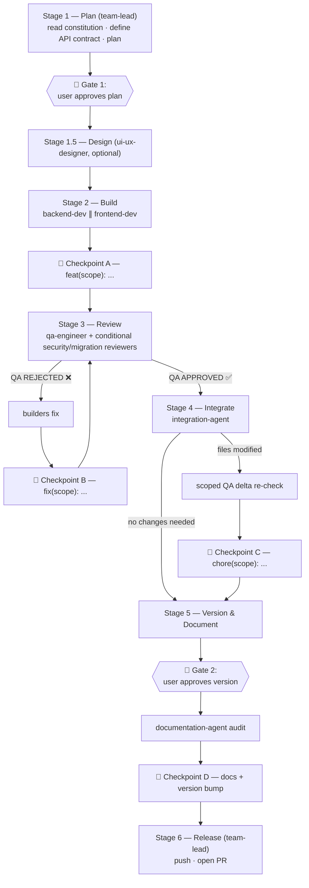

# 01 — The Pipeline

The pipeline is the fixed path every change travels from idea to pull request.
Six stages for features, three for hotfixes. The orchestrator (`team-lead`)
drives it; specialists execute it; you approve it at exactly two points.

## Choosing a lane

| Change type | Lane | Stages |
| :--- | :--- | :--- |
| New feature, module, page, refactor, non-trivial bug fix | **Full pipeline** | 1 → (1.5) → 2 → 3 → 4 → 5 → 6 |
| Small fix meeting **all** hotfix criteria (below) | **Hotfix lane** | Plan → Build+Review → Document+Release |
| UI/UX design or redesign | Full pipeline **+ Stage 1.5** | 1 → 1.5 → 2 → 3 → 4 → 5 → 6 |

## The full pipeline at a glance



---

## Stage 1 — Plan (`team-lead`)

The orchestrator:

1. **Reads the project constitution** (`CLAUDE.md`) in full, plus the files
   the task will touch.
2. **Defines the API contract** — if the change crosses the backend/frontend
   boundary, the orchestrator writes a contract block *before* anyone builds:

   ```json
   {
     "endpoint": "GET /api/widgets/{id}/stats",
     "auth": "required (session or token)",
     "request": { "query": { "period": "day|week|month" } },
     "response": {
       "data": {
         "total": "number",
         "series": [{ "date": "YYYY-MM-DD", "value": "number" }]
       }
     },
     "errors": { "404": "widget not found", "422": "invalid period" }
   }
   ```

   This exact block is pasted **verbatim into both builder prompts** in
   Stage 2. The single most common failure of parallel AI development is the
   frontend guessing a response shape the backend never produced; a shared,
   literal contract removes the guess. (Format spec:
   [templates/api-contract.md](../templates/api-contract.md).)
3. **Presents a plan**: files to create/modify/delete, reasoning, contract,
   and which lane the change takes.
4. **Waits for explicit user approval — Gate 1.** No code before approval.
5. **Creates the branch**: `git checkout {{MAIN_BRANCH}} && git pull &&
   git checkout -b feature/<name>`.

## Stage 1.5 — Design (`ui-ux-designer`, optional)

Only for tasks with meaningful UI surface. Produces layout/component
specifications that are included in the frontend (and, where relevant,
backend) prompts. Skipping this stage for a UI-heavy task is how you get
functionally-correct screens users can't parse.

## Stage 2 — Build (`backend-dev` ∥ `frontend-dev`)

The orchestrator spawns both builders **in one message** (parallel execution)
when their tasks are independent — the API contract is what makes them
independent. Each spawn prompt is self-contained: branch name, the task, file
lists, specs, the contract, and the rules (sub-agents have no conversation
history — see [chapter 03](03-communication-protocol.md)).

**Resource ownership** (not just file ownership) is assigned in the prompts:

- Exclusive file lists — shared files (routes, config, seeders) belong to
  exactly one builder.
- Exactly one builder may run database-touching tests during this stage.
- The frontend builder exclusively owns `{{BUILD_COMMAND}}`.

Builders finish by reporting what they changed **plus prove-it-ran evidence**
(test output, an HTTP response, a REPL result) — Stage 3 verifies claims; it
shouldn't have to discover basic facts.

> **📌 Checkpoint A** — the orchestrator commits: `feat(scope): <description>`.
> QA reviews committed state, so its diff is reproducible.

## Stage 3 — Review (`qa-engineer` + conditional reviewers)

Before spawning QA, the orchestrator **pre-scans the diff paths** and spawns
the conditional reviewers **in parallel with QA** when triggered (all three
are read-only, so they cannot conflict):

| Trigger in diff | Reviewer |
| :--- | :--- |
| Database migration files | `migration-reviewer` |
| New/modified endpoints, auth/authz, webhooks, file uploads, payment logic, external integrations, new permissions | `security-reviewer` |

QA reviews every changed file (`git diff origin/{{MAIN_BRANCH}}...HEAD`),
checks the [bug-pattern library](04-bug-patterns.md), runs `{{LINT_COMMAND}}`,
runs **targeted tests** per `{{FULL_SUITE_POLICY}}`, and **empirically
exercises the primary affected flow once** (an HTTP call, a REPL render — not
just reading). If QA discovers sensitivity the path-scan missed, it reports
`CONDITIONAL REVIEWS REQUIRED: [...]` and the orchestrator spawns the missing
reviewer before proceeding.

Verdicts: `QA APPROVED ✅` or `QA REJECTED ❌` with numbered
`[CRITICAL]`/`[WARNING]` findings. On rejection, the orchestrator sends the
findings to the responsible builder, then re-runs QA. Both conditional
reviewers must report `APPROVED ✅` before the stage can pass.

> **📌 Checkpoint B** (only if fixes happened) —
> `fix(scope): address QA feedback`.

## Stage 4 — Integrate (`integration-agent`)

Code being correct is not the same as code being *connected*. This agent
walks the integration layers (navigation, permissions, event listeners,
scheduled jobs, settings reads, analytics — the
[phantom checks](05-phantom-checks.md)) and **fixes** wiring gaps directly —
"connect, not rebuild." It runs `{{LINT_COMMAND}}` on anything it touched and
reports `INTEGRATION COMPLETE ✅` or `INTEGRATION BLOCKED ⚠️` (naming the
responsible agent).

**v1.1 fix — the delta re-check.** If integration modified any files, the
orchestrator spawns a **scoped QA re-check on the delta only**
(`git diff <Checkpoint-B-or-A SHA>..HEAD`) before committing. In v1.0,
integration changes reached the PR with no independent review — a real hole
we found in our own history.

> **📌 Checkpoint C** (only if files were modified) —
> `chore(scope): integration wiring`.

## Stage 5 — Version & Document

**v1.1 fix — version first, then docs.** The orchestrator proposes the version
bump (per the decision guide below) and asks for approval — **Gate 2** (skip
by setting `{{AUTO_VERSION}}: true`). Only then does it spawn
`documentation-agent`, passing the approved version — so the CHANGELOG heading
and any version references are written once, correctly. (In v1.0 the docs
stage ran before the version existed, guaranteeing drift.)

| Change | Bump |
| :--- | :--- |
| Breaking change, schema migration with data impact | MAJOR |
| New feature, new module | MINOR |
| Bug fix, small improvement | PATCH |
| Docs/chore only | none |

The documentation agent audits every governed doc (CHANGELOG **always**;
API reference, data dictionary, user guides, constitution — per the project's
doc-update map) and reports `DOCUMENTATION AUDIT: COMPLETE ✅` or
`DOCUMENTATION AUDIT: BLOCKED ⚠️`. No PR until COMPLETE.

> **📌 Checkpoint D** — `docs: update documentation and bump version to vX.Y.Z`
> (includes the `VERSION` file change).

## Stage 6 — Release (`team-lead`)

The orchestrator pushes the branch and opens the PR:
`gh pr create --base {{MAIN_BRANCH}}` with the
[PR body template](../templates/pr-body.md) — summary, stage-by-stage verdicts,
files changed, test results. Git tags are created only **after** merge, never
on feature branches.

---

## The hotfix lane

Three stages, one builder, no integration pass. **Eligibility — every box must
be true**, otherwise it's a feature and takes the full pipeline:

- [ ] Touches ≤ 2 closely related files
- [ ] No new functions, classes, or methods (edits within existing ones only)
- [ ] No database migrations
- [ ] No new permissions, routes, or middleware
- [ ] No UI layout changes (copy fixes are fine)
- [ ] No new dependencies

Flow: **Plan** (orchestrator reads, explains, gets approval, branches
`hotfix/<name>`) → **Build + Review** (one builder implements; QA verifies
with targeted tests; commit `fix(scope): ...`) → **Document + Release**
(documentation agent updates at minimum the CHANGELOG; commit; push; PR).

The eligibility checklist is the enforcement mechanism, not a suggestion. The
most expensive failure mode of any fast lane is scope creep — "while I'm here"
is how a two-line fix becomes an unreviewed feature.

## Commit checkpoint summary

| Checkpoint | After stage | Type | Condition |
| :--- | :--- | :--- | :--- |
| **A** | 2 — Build | `feat(scope):` | always |
| **B** | 3 — Review | `fix(scope):` | only if QA required fixes |
| **C** | 4 — Integrate | `chore(scope):` | only if integration modified files (after delta re-check) |
| **D** | 5 — Version & Document | `docs:` + VERSION bump | always |

Four checkpoints exist for crash resilience as much as legibility: a session
that dies mid-pipeline loses at most one stage of work, and a fresh session
can resume from the last checkpoint using the
[pipeline state file](../templates/pipeline-state.md.template).
